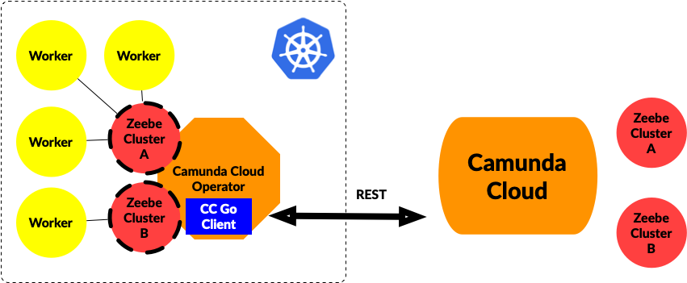

 


# Camunda Cloud Kubernetes Zeebe Operator

This repository contains the source code for the Zeebe Operator for Camunda Cloud. 
This Kubernetes Operator allows you to create `ZeebeCluster` Kubernetes resources in your own Kubernetes Cluster that will map to Zeebe Clusters provisioned inside Camunda Cloud. 

The main objective of this operator is to give you native control of your Zeebe Clusters from inside your Kubernetes environment, allowing other applications to have a local object to query to connect to these remote resources. By having a Zeebe Cluster resource type you can manage remote Zeebe Clusters locally and leverage the declarative nature of Kubernetes Resources to manage your Zeebe Clusters inside Camunda Cloud. 

# Pre-Requisites
Camunda Cloud Account: https://accounts.cloud.camunda.io/signup


# Installation

The operator can be installed using helm or by building it locally and running it against your Kubernetes Cluster:

## Helm 

```
helm repo add zeebe http://helm.zeebe.io
helm repo update
```

The chart depends on a secret called `camunda-cloud-credentials` containing both the Cliend Id (cc-client-id) and Secret Id (cc-secret-id)
You can create this secret by running

```
kubectl create secret generic camunda-cloud-credentials --from-literal=cc-client-id=<CLIENT_ID> --from-literal=cc-client-secret=<CLIENT_SECRET>
```

Then you can install the Operator chart:

```
helm install operator zeebe/zeebe-operator-cc
```


## Build and run from source

1) Git Clone the project
2) Export CC_CLIENT_ID and CC_CLIENT_SECRET obtained from your Camunda Cloud account 
3) Having kubectl connected to a kubernetes cluster you can run `make install` to install the custom CRD for ZeebeClusters
4) Once the CRDs are present in the cluster you can run `make run` to start the operator


# Operator Use Cases

How does this work? 

1) You can create a Custom Kubernetes Resource (CRD) to define a `ZeebeCluster`
2) The Operator will pick up this resource and if a Camunda Cloud account is configured, it will provision a new ZeebeCluster inside Camunda Cloud
3) The `ZeebeCluster` resource created locally, provides all the details about the remote provisioned cluster, for other components to connect to it. 


The Operator also implements a bi-directional sync. If enabled, when connecting to Camunda Cloud, it will create local resources to match existing Zeebe Clusters inside the Camunda Cloud account.




# Future work

Unify helm chart deployments and Camunda Cloud deployments in a single operator. Remote and Local clusters should be managed and exposed in the same way. 

# Dependencies

The Camunda Cloud Kubernetes Zeebe Operator depends on the [Camunda Cloud Client Go Library](https://github.com/camunda-community-hub/camunda-cloud-go-client/)


